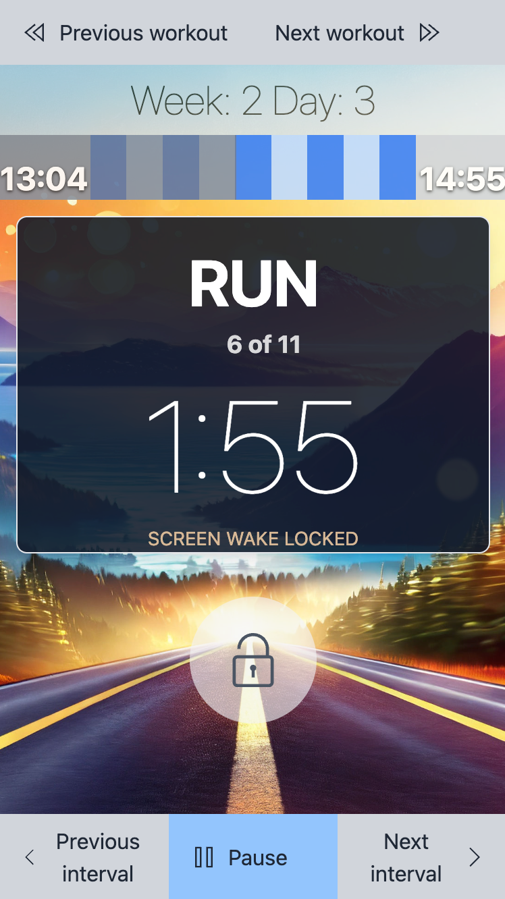

# Simple C25K
A simple running interval timer inspired by the Couch to 5K program.

## Install

This app is not currently in any of the app stores, but it can simply be installed with supported browsers by visiting https://www.frodare.com/simple-c25k/ and clicking the install button .

Detailed install instructions can be found [here](https://support.google.com/chrome/answer/9658361?hl=en&co=GENIE.Platform%3DDesktop).

## Features
✓ No ads, no tracking

✓ Installable PWA

✓ Lockable UI

✓ Auto screen wake lock

## But why?
I primarily built this as an experiment with Vite and PWAs.
That being said, in the past, I had difficulty finding the C25K app I wanted. I was searching for a quick and simple interval timer app for C25K, without unnecessary features, paywalls, or annoying ads. Unfortunately, the most popular apps were overly bloated. The worst part was that many of them had some kind of paywall after the first week, even for a simple timer app.

## Experimentation
While this is a functional C25K application, it was primarily developed as a testbed to explore technologies that I have been interested in but haven't had the opportunity to work with.

### Vite
This is my first time using [Vite](https://vitejs.dev/), formerly only having used CRA or a manual Webpack setup. Overall, it was an enjoyable change. The builds were fast, and it was easy to set up, although this app is too small to see any significant speed increase. I look forward to experimenting more with it in the future.

### Tailwind CSS
This is also my first exposure to [Tailwind CSS](https://tailwindcss.com/). I had heard about it in the past but assumed it was similar to Bootstrap or MaterialUI. I am glad I decided to use it for this project because it is actually quite different and provides a refreshing change.

### PWA
This was also my first time creating a [PWA (Progressive Web App)](https://web.dev/explore/progressive-web-apps). Years ago, when HTML5 emerged, I had hoped that most native apps would be replaced with websites. Unfortunately, that didn't happen. I'm not including apps built with web technologies but served on a native platform like Cordova, Ionic, ReactNative, etc. I dislike having to install a plethora of one-off apps that I only end up uninstalling later. That's why I'm excited about PWAs and really hope they start to gain more popularity.

### Redux Toolkit
I used Redux on all of my early React projects and always enjoyed using it. However, it seems that many of the people I have worked with since, as well as the general sentiment on the internet, do not share the same enthusiasm. As a result, the newer projects I have worked on do not utilize Redux. Consequently, I haven't had the opportunity to try out Redux Toolkit, which I only discovered after I stopped using Redux. After experimenting with it in this project, I would definitely use it again, especially on a TypeScript project. In fact, with its use, many of the arguments against Redux fall apart.

### Adobe Firefly
This one is a bit of an oddball, but I thought I would add it here anyway. The background image and app logo were created by [Adobe Firefly](https://www.adobe.com/sensei/generative-ai/firefly.html), a generative AI for creating images. The technology behind AI image generation is fascinating, and this gave me an opportunity to actually put it to use.

## Future ideas
- add an install button for the PWA
- UI polish (images, buttons, layout)
- disable text highlighting during long press
- settings screen (auto weak lock, enable sound/vibration)
- add more routines such as N2R, a 6 week C25K, run-jog intervals along with a way to select them
- in app workout creator
- workout history
- build pipeline using Github Actions
  - add build version
  - auto deploy on PR merge
  - add more tests
  - create stricter lint rule

